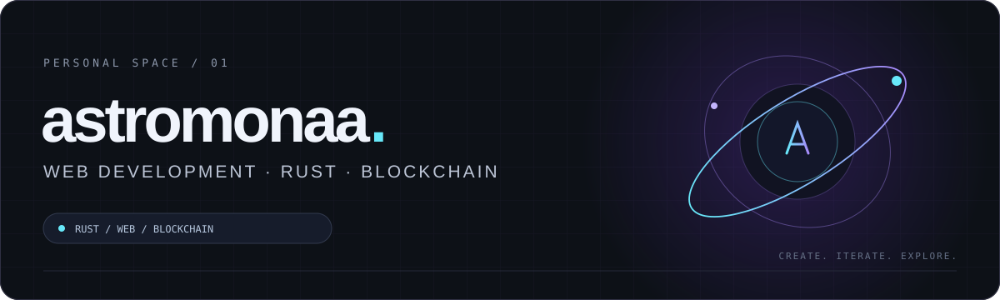
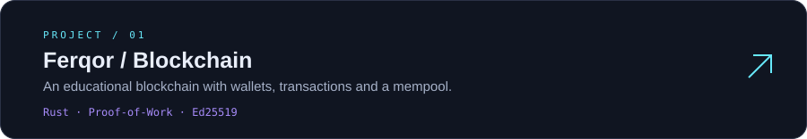
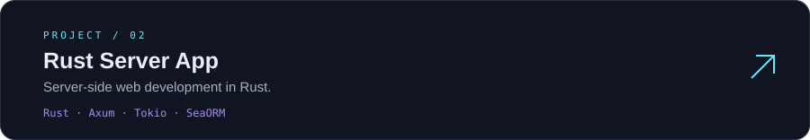
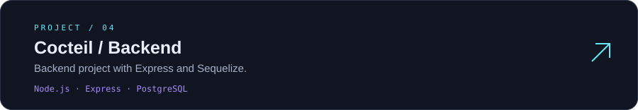

  

  <a href="https://github.com/astromonaa?tab=repositories">Explore my repositories</a>
  &nbsp; · &nbsp;
  <a href="https://github.com/astromonaa/Cocteil-front">Cocteil frontend</a>
  &nbsp; · &nbsp;
  <a href="https://github.com/astromonaa/Cocteil-back">Cocteil backend</a>

### About this space

I work on web development, Rust and blockchain. My repositories include Vue/Nuxt and React interfaces, Node.js APIs and a Rust web server.

### Tech stack

### Selected projects

  <a href="https://github.com/astromonaa?tab=repositories">View all repositories →</a>

